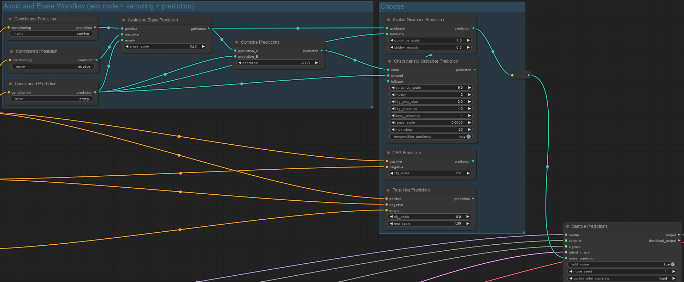

# ComfyUI-Prediction
Fully customizable Classifier Free Guidance for [ComfyUI](https://github.com/comfyanonymous/ComfyUI).

Copyright 2024 by @RedHotTensors and released by [Project RedRocket](https://huggingface.co/RedRocket).

# Installation
Clone this repo into ``ComfyUI/custom_nodes`` or use [ComfyUI-Manager](https://github.com/ltdrdata/ComfyUI-Manager).

(Optional) If you want beautiful teal PREDICTION edges like the example apply [patches/colorPalette.js.patch](https://raw.githubusercontent.com/redhottensors/ComfyUI-Prediction/main/patches/colorPalette.js.patch) to ``ComfyUI/web/extensions/core/colorPalette.js``.

# Usage
All custom nodes are provided under <ins>Add Node > sampling > prediction</ins>. An example workflow is in ``examples/avoid_and_erase.json``.

Follow these steps for fully custom prediction:
1. You will need to use the <ins>sampling > prediction > Sample Predictions</ins> node as your sampler.
2. The *sampler* input comes from <ins>sampling > custom_sampling > samplers</ins>. Generally you'll use **KSamplerSelect**.
3. The *sigmas* input comes from <ins>sampling > custom_sampling > schedulers</ins>. If you don't know what sigmas you are using, try **BasicScheduler**. (NOTE: These nodes are **not** in the "sigmas" menu.)
4. You'll need one or more prompts. Chain <ins>conditioning > CLIP Text Encode (Prompt)</ins> to <ins>sampling > prediction > Conditioned Prediction</ins> to get started.
5. After your prediction chain, connect the result to the *noise_prediction* input of your **Sample Predictions** node.

# Predictors

## Primitive Nodes
All other predictions can be implemented in terms of these nodes. However, it may get a little messy.

### Conditioned Prediction 
Evaluates your chosen model with a prompt (conditioning). You need to pick a unique conditioning name like "positive", "negative", or "empty".

The names are arbitrary and you can choose any name, but the names may eventually interact with ControlNet if/when it's implemented.

### Combine Predictions
Operates on two predictions. Supports add (+), subtract (-), multiply (*), divide (/), [vector projection](https://en.wikipedia.org/wiki/Vector_projection) (proj), [vector rejection](https://en.wikipedia.org/wiki/Vector_projection) (oproj), min, and max.

``prediction_A <operation> prediction_B``

### Scale Prediction
Linearly scales a prediction.

``prediction * scale``

### Switch Predictions 
Switches from one prediction to another one based on the timestep sigma. Use <ins>sampling > custom_sampling > sigmas > Split Sigmas</ins> to create a sub-range of timestep sigmas.

``prediction_B when current_sigma in sigmas_B otherwise prediction_A``

### Scaled Guidance Prediction
Combines a baseline prediction with a scaled guidance prediction using optional standard deviation rescaling, similar to CFG.

Without ``stddev_rescale``: ``baseline + guidance * scale`` 
With ``stddev_rescale``: [See §3.4 of this paper.](https://arxiv.org/pdf/2305.08891.pdf) As usual, start out around 0.7 and tune from there.

### Characteristic Guidance Prediction
Combines an unconditioned (or negative) prediction with a desired, conditioned (or positive) prediction using a [characteristic correction](https://arxiv.org/pdf/2312.07586.pdf).

``cond``: Desired conditioned or positive prediction. This prediction should not be independent of the unconditioned prediction. 
``uncond``: Unconditioned or negative prediction. 
``fallback``: Optional prediction to use in the case of non-convergence. Defaults to vanilla CFG if not connected. 
``guidance_scale``: Scale of the independent conditioned prediction, like vanilla CFG. 
``history``: Number of prior states to retain for Anderson acceleration. Generally improves convergence speed but may introduce instabilities. Setting to 1 disables Anderson acceleration, which will require a larger max_steps and smaller log_step_size to converge. 
``log_step_size``: log10 learning rate. Higher values improve convergence speed but will introduce instabilities. 
``log_tolerance``: log10 convergence tolerance. Higher values improve convergence speed but will introduce artifacts. 
``keep_tolerance``: A multiplier greater than 1 relaxes the tolerance requirement on the final step, returning a mostly-converged result instead of using the fallback. 
``reuse_scale``: A multiplier greater than 0 retains a portion of the prior correction term between samples. May improve convergence speed and consistency, but may also introduce instabilities. Use with caution. 
``max_steps``: Maximum number of optimizer steps before giving up and using the fallback prediction. 
``precondition_gradients``: Precondition gradients during Anderson acceleration. This is strongly recommended, but may decrease result quality in specific cases where the gradients are reliably well-conditioned.

This node is extremely expensive to evaluate. It requires four full model evaluations plus two full evaluations for each optimizer step required.
It's recommended that you use the **Switch Predictions** node to skip CHG on the first timestep as convergence is unlikely and to disable it towards the end of sampling as it has marginal effect.

## Prebuilt Nodes

### Interpolate Predictions
Linearly interpolates two predictions.

``prediction_A * (1.0 - scale_B) + prediction_B * scale_B``

### CFG Prediction
Vanilla Classifier Free Guidance (CFG) with a positive prompt and a negative/empty prompt. Does not support CFG rescale.

``(positive - negative) * cfg_scale + negative``

### Perp-Neg Prediction
Implements https://arxiv.org/abs/2304.04968.

``pos_ind = positive - empty; neg_ind = negative - empty`` 
``(pos_ind - (neg_ind oproj pos_ind) * neg_scale) * cfg_scale + empty``

### Avoid and Erase Prediction
Re-aligns a desirable (positive) prediction called *guidance* away from an undesirable (negative) prediction called *avoid_and_erase*, and erases some of the negative prediction as well.

``guidance - (guidance proj avoid_and_erase) * avoid_scale - avoid_and_erase * erase_scale``

# Limitations
ControlNet is not supported at this time.

Regional prompting may work but is totally untested.

Any other advanced features affecting conditioning are not likely to work.

# License
The license is the same as ComfyUI, GPL 3.0.
